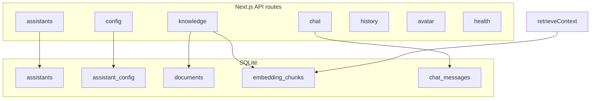

# Backend implementation plan: multi-assistant AI platform

## Current baseline (gap analysis)

| Area       | Today                                                                                                                                  | Spec requirement                                                                    |
| ---------- | -------------------------------------------------------------------------------------------------------------------------------------- | ----------------------------------------------------------------------------------- |
| Storage    | `[.data/assistant-config.json](e:\aura-speak\lib\store\paths.ts)`, `[.data/vector-store.json](e:\aura-speak\lib\store\vectorStore.ts)` | SQLite (or structured DB) with `assistant_id` on all rows                           |
| Assistants | Client-only in `[contexts/AssistantContext.tsx](e:\aura-speak\contexts\AssistantContext.tsx)`                                          | `POST/GET/DELETE /api/assistants`, `GET /api/assistants/:id`                        |
| Config     | [GET/PUT `/api/config](e:\aura-speak\app\api\config\route.ts)` — single global config                                                  | `GET/PUT` with `assistant_id` (query/body)                                          |
| RAG        | `[retrieveContext](e:\aura-speak\lib\services\ragService.ts)` scans **all** chunks                                                     | Filter by `assistant_id`; ingest stores `assistant_id`                              |
| Chat       | `[POST /api/chat](e:\aura-speak\app\api\chat\route.ts)` — `query`, no server history                                                   | `assistant_id`, optional `message` alias, persist messages, `GET /api/chat/history` |
| Models     | `[POST /api/models](e:\aura-speak\app\api\models\route.ts)`                                                                            | Spec names `POST /api/models/connect` — same behavior, add route alias              |
| Avatar     | `[POST /api/avatar](e:\aura-speak\app\api\avatar\route.ts)`, env-driven HeyGen vs LiveAvatar                                           | Explicit `provider: "liveavatar"                                                    |
| Health     | None                                                                                                                                   | `GET /api/health`                                                                   |

Chunking already exists (~512 chars, overlap 64) in `[ragService.ts](e:\aura-speak\lib\services\ragService.ts)`; tune toward ~500 tokens / ~50 overlap if you measure by tokenizer later.

**SSE note:** The app today emits **JSON lines** (`data: {"type":"token",...}\n\n`), which `[services/api.ts](e:\aura-speak\services\api.ts)` parses. Your spec’s raw `data: Hello` example would **break the current UI** unless the client is rewritten. Plan: **keep structured SSE** for streaming tokens + `sources` + `done`; document the wire format. If you require literal token-per-line SSE, add a follow-up task to change both `[askQuestionStream](e:\aura-speak\services\api.ts)` and the chat route.

---

## Architecture (target)

---

## Phase 1 — Database layer (`better-sqlite3`)

- Add dependency `**better-sqlite3**` (Node runtime only; already used on routes with `export const runtime = "nodejs"`).
- New module e.g. `[lib/db/schema.sql](e:\aura-speak\lib\db)` + `[lib/db/client.ts](e:\aura-speak\lib\db)` (singleton connection, WAL mode, path under `.data/app.db`).
- **Tables (minimal):**
  - `assistants` — `id` (TEXT PK UUID), `name`, `description`, `created_at`
  - `assistant_config` — `assistant_id` (FK), one row per assistant, columns matching `[AssistantConfig](e:\aura-speak\lib\types\ai.ts)` + migrations for new fields
  - `documents` — `id`, `assistant_id`, `name`, `status`, `created_at`, `error`
  - `embedding_chunks` — `id`, `assistant_id`, `doc_id`, `name`, `text`, `embedding` (store as BLOB JSON array or TEXT JSON)
  - `chat_messages` — `id`, `assistant_id`, `role`, `content`, `created_at` (optional `conversation_id` if you want threads later; start with single thread per assistant)
- **Migration script:** one-time import from existing `[readConfig](e:\aura-speak\lib\store\configStore.ts)` + `[vectorStore](e:\aura-speak\lib\store\vectorStore.ts)` into `assistant_id = 'default'`, then flip reads to DB. Keep JSON files as backup until verified.

---

## Phase 2 — Assistant APIs

- `**POST /api/assistants`** — validate body `{ name, description? }`, insert row, seed `assistant_config` from `[defaultAssistantConfig()](e:\aura-speak\lib\types\ai.ts)`, return assistant.
- `**GET /api/assistants`** — list all.
- `**GET /api/assistants/[id]/route.ts`** — assistant row + merged config JSON.
- `**DELETE /api/assistants/[id]/route.ts`** — transactional delete: config, documents metadata, chunks, chat_messages, then assistant row (and delete upload files under `.data/uploads/{assistant_id}/...` if you namespace uploads).

---

## Phase 3 — Config (auto-save)

- Replace global file reads in `[configStore.ts](e:\aura-speak\lib\store\configStore.ts)` with **per-assistant** reads/writes keyed by `assistant_id`.
- `**GET /api/config?assistant_id=`** — required param (or default `default` during transition).
- `**PUT /api/config`** — require `assistant_id` in body (add to `[configPutSchema](e:\aura-speak\lib\api\schemas.ts)`); merge into `assistant_config` row; return updated config JSON.

---

## Phase 4 — RAG (scoped)

- Extend `[DocumentRecord](e:\aura-speak\lib\types\ai.ts)` / `[ChunkRecord](e:\aura-speak\lib\types\ai.ts)` with `assistantId` (or snake_case in DB only).
- `[ingestDocumentBuffer](e:\aura-speak\lib\services\ragService.ts)`: accept `assistant_id`; write chunks/documents with FK.
- `[retrieveContext](e:\aura-speak\lib\services\ragService.ts)`: `getChunksByAssistant(assistant_id)` instead of `getAllChunks()`.
- `**GET /api/knowledge?assistant_id=`** — filter list.
- `**POST /api/knowledge`** — `assistant_id` from query or multipart field (multipart is cleaner for FormData).
- `**POST /api/reindex`** — accept `assistant_id`, re-embed all docs for that assistant.
- Update `[knowledge/[id]/route.ts](e:\aura-speak\app\api\knowledge\[id]\route.ts)` to verify document belongs to assistant (from header or query).

---

## Phase 5 — Chat + history

- Extend `[chatBodySchema](e:\aura-speak\lib\api\schemas.ts)`: `assistant_id` (required), support `**message**` as alias of `**query**` (or rename to `message` only and update client in same PR).
- Chat handler flow in `[chat/route.ts](e:\aura-speak\app\api\chat\route.ts)`:
  1. Load config by `assistant_id`
  2. `retrieveContext(query, config, assistant_id)`
  3. Optionally load last N messages from `chat_messages` for `messages` if client does not send history
  4. Stream as today; on completion (non-stream or stream end), **insert** user + assistant rows
- `**GET /api/chat/history?assistant_id=`** — paginated list (limit/offset query params).

---

## Phase 6 — Models + health

- Add `**app/api/models/connect/route.ts`** — `POST` with `{ provider, base_url }`, delegate to same logic as existing `[POST /api/models](e:\aura-speak\app\api\models\route.ts)` (avoid duplication via shared handler).
- `**GET /api/models?assistant_id=`** — optional: use that assistant’s `baseUrl`/`provider` from DB instead of global; else keep current behavior for backward compatibility.
- `**GET /api/health`** — `{ status: "ok", providers: { ollama: boolean } }` by probing default Ollama URL or env; extend with `db: "ok"` after SQLite connect.

---

## Phase 7 — Avatar

- Extend `[avatarBodySchema](e:\aura-speak\lib\api\schemas.ts)`: `provider: z.enum(["liveavatar","heygen"]).optional()` — if omitted, keep current `[AVATAR_BACKEND](e:\aura-speak\lib\services\avatarService.ts)` env behavior.
- Route `[avatar/route.ts](e:\aura-speak\app\api\avatar\route.ts)`: branch on `provider` instead of/in addition to env.
- Optional: `voice_id` forwarded to `[createLiveAvatarEmbed](e:\aura-speak\lib\services\liveAvatarSession.ts)` (already supported in LiveAvatar OpenAPI body).

---

## Phase 8 — Error handling + performance

- Central helper `jsonError(status, code, message, details?)` for consistent `{ error: { code, message } }`.
- Map known failures: provider timeout, empty model list, embedding dimension mismatch, avatar upstream errors (reuse `[LiveAvatarHttpError](e:\aura-speak\lib\services\liveAvatarSession.ts)`).
- Keep ingest async-friendly: long embedding batches can use chunked `Promise` or worker later; for Phase 1, document max upload size (already 10MB in knowledge route).

---

## Phase 9 — UI alignment (contract only; minimal client edits)

Backend changes are useless without the client sending `assistant_id`. Minimum follow-ups (separate small PR or same if coordinated):

- `[services/api.ts](e:\aura-speak\services\api.ts)` — pass `assistant_id` from `[useAssistant](e:\aura-speak\contexts\AssistantContext.tsx)` into `fetch` for config, chat, knowledge, avatar.
- Replace or sync “assistants list” with `**GET /api/assistants`** so assistants survive refresh across devices.

---

## Risk / order of work

1. **Do DB + assistants + config scoping first** — everything else hangs on `assistant_id`.
2. **Breaking change:** global config file removed after migration — document one-time migration command (`pnpm tsx scripts/migrate-to-sqlite.ts`).
3. **Tests:** add integration tests for assistant delete cascades and RAG isolation (two assistants, overlapping names).

---

## Out of scope (unless you expand spec)

- LITE LiveAvatar Web SDK (audio pipe) — different product surface; not part of REST “avatar URL” flow.
- Multi-tenant auth / user accounts.
- Horizontal scaling of SQLite (single-node production OK; otherwise Postgres later).

