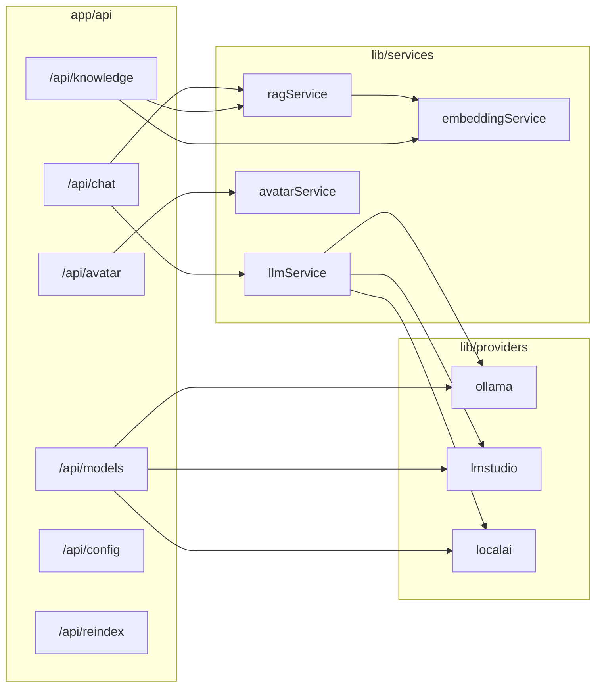

# Next.js AI assistant backend (API routes + services)

## Current gap

- There are **no** `[app/api](e:\temp\app)` route handlers yet; only `[lib/utils.ts](e:\temp\lib\utils.ts)` exists under `lib/`.
- The UI already calls a **contract** from `[services/api.ts](e:\temp\services\api.ts)`: `POST …/ask`, `…/avatar`, `…/documents`, `DELETE …/documents/:id`, `POST …/reindex`, `GET …/models`, `PUT …/config`, with default `backendUrl` = `http://localhost:3001` (`[SettingsPage.tsx](e:\temp\components\views\SettingsPage.tsx)`).
- Model discovery in `[ModelSettings.tsx](e:\temp\components\views\ModelSettings.tsx)` currently hits **Ollama directly** (`fetchOllamaModels(ollamaUrl)`), not the backend.
- Follow workspace rule: before implementing route handlers, read the **local** Next.js guide under `node_modules/next/dist/docs/` (this repo’s Next 16.x may differ from generic docs).

## Target architecture

## API contract (dashboard alignment)

| Current client path (`[api.ts](e:\temp\services\api.ts)`)    | New route                                               | Notes                                                                                                                                                                                                                                                                   |
| ------------------------------------------------------------ | ------------------------------------------------------- | ----------------------------------------------------------------------------------------------------------------------------------------------------------------------------------------------------------------------------------------------------------------------- |
| `POST /ask`                                                  | `POST /api/chat`                                        | Body: include `query`, optional `messages`, `stream`. Response: JSON `{ answer, sources? }` when not streaming; or **stream** (see below).                                                                                                                              |
| `POST /avatar`                                               | `POST /api/avatar`                                      | Same body shape (`text`, `heygenApiKey`, `avatarId`).                                                                                                                                                                                                                   |
| `POST /documents`, `GET /documents`, `DELETE /documents/:id` | `POST/GET /api/knowledge`, `DELETE /api/knowledge/[id]` | Multipart upload on POST; list on GET for parity.                                                                                                                                                                                                                       |
| `POST /reindex`                                              | `POST /api/reindex`                                     | Rebuild index from stored docs.                                                                                                                                                                                                                                         |
| `GET /models`                                                | `GET /api/models` **or** derive from POST               | `[getModels()](e:\temp\services\api.ts)` expects `{ llm: string[]; embedding: string[] }`. Implement **POST** per spec (`provider`, `base_url`); add **GET** that returns cached/split lists from server config so existing `getModels()` keeps working without a body. |
| `PUT /config`                                                | `PUT /api/config` (+ optional `GET`)                    | Persist `llmModel`, `embeddingModel`, `temperature`, `topP`, `maxTokens`, `ollamaUrl`, `provider`, etc., server-side (see storage).                                                                                                                                     |

**Base URL behavior:** Introduce a small helper so when `ai-assistant-backend-url` is **empty** or unset, requests use **same-origin** paths (`/api/chat`, …). Default the settings field to empty (or document “leave blank for embedded API”) so the Next app can call itself without port 3001.

## Core libraries

1. `**lib/services/llmService.ts`** — Single entry `generateResponse({ provider, model, baseUrl, prompt, messages?, stream, temperature, topP, maxTokens })` delegating to providers. Map `stream: true` to async iterables or raw fetch streams and expose a **unified** way to build a `ReadableStream` for the route handler.
2. `**lib/providers/{ollama,lmstudio,localai}.ts`** — Thin adapters:
  - **Ollama**: `/api/tags` for models; `/api/chat` or `/api/generate` with `stream` for generation; `/api/embeddings` for embeddings.
  - **LM Studio / LocalAI**: OpenAI-compatible `/v1/models`, `/v1/chat/completions` (streaming), `/v1/embeddings` where applicable.
3. `**lib/services/embeddingService.ts`** — `embed(texts: string[], model, provider, baseUrl)` returning `number[][]`, routed through the same provider enum as LLM.
4. `**lib/services/ragService.ts`** — `retrieveContext(query, options)` → top-k chunks + **source metadata** (file name, chunk id) for `sources` in chat responses. `ingestDocument(file)` → extract text → chunk (fixed size + overlap) → embed → store.
5. `**lib/services/avatarService.ts`** — Wrap HeyGen REST calls (session/stream URL) using API key from request body (or `HEYGEN_API_KEY` env override for server-only deployments).
6. **Storage (non-blocking constraint)**
  - **Phase 1 (no Postgres):** JSON or SQLite-like file under e.g. `.data/` (gitignored): config blob + document metadata + chunk vectors (arrays). Good enough for dev and demos.  
  - **Phase 2 (optional):** If `DATABASE_URL` is set, use `pg` + `pgvector` for chunks and metadata; same service interfaces, swapped implementation.
7. **Async ingest:** For large files, `POST /api/knowledge` can return **202** with `{ id, status: "processing" }` and process chunking/embedding in `after()` / background continuation (per Next 16 docs), or sync for small files only—document the choice in code comments.

## Streaming (`POST /api/chat`)

- When `stream: true` (or `Accept: text/event-stream`): return `new Response(readableStream, { headers: { "Content-Type": "text/event-stream" | "text/plain; charset=utf-8" } })` forwarding provider tokens.
- **Frontend:** Today `[askQuestion](e:\temp\services\api.ts)` uses `res.json()`. Add `askQuestionStream` (or extend `askQuestion` with an option) and update `[ChatPage.tsx](e:\temp\components\views\ChatPage.tsx)` / `[Overview.tsx](e:\temp\components\views\Overview.tsx)` to append assistant content incrementally so streaming is visible (sources can be sent in a final SSE event or a trailing JSON line—pick one format and document it).

## Dependencies to add (typical)

- Server: `pg` + `@types/pg` (optional path), text extraction: `pdf-parse` or lightweight alternative; consider `zod` (already in project) for request validation.
- No duplicate client libs required for Ollama/LM Studio if using `fetch` only.

## Security / ops

- Document that passing `heygenApiKey` from the browser is convenient for local dev; production should prefer server env vars.
- Rate-limit and size limits on uploads (`/api/knowledge`) to keep endpoints responsive.

## Implementation order

1. Config store + `GET/PUT /api/config` + shared types.
2. Provider modules + `POST /api/models` (+ `GET /api/models` for split lists).
3. Embedding + in-memory/file vector store + `ragService`.
4. `POST /api/chat` (non-streaming first), then streaming + client updates.
5. Knowledge routes (`GET/POST /api/knowledge`, `DELETE /api/knowledge/[id]`, `POST /api/reindex`).
6. `POST /api/avatar`.
7. Wire `[services/api.ts](e:\temp\services\api.ts)` to `/api/...` and adjust settings default URL; optionally switch `[ModelSettings](e:\temp\components\views\ModelSettings.tsx)` “Connect” to `POST /api/models` for multi-provider discovery.

